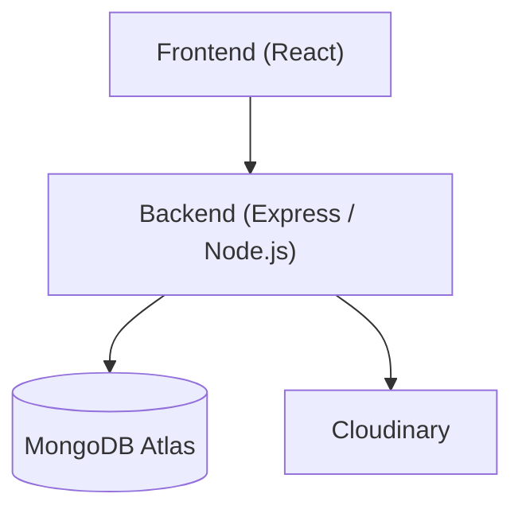

# Art Club — Backend API

[](https://github.com/vsvala/Art_Club_back/actions/workflows/ci.yml)

> This is the **backend** of the Art Club fullstack project.
> Frontend repository: [github.com/vsvala/Art_Club](https://github.com/vsvala/Art_Club)

**Production:** [artclub-q41z.onrender.com](https://artclub-q41z.onrender.com)

Art Club Backend is an authenticated gallery API for managing artworks, user roles, and event content. It combines secure login, image uploads, and role-based access control with a small weather integration endpoint.

The project is a practical portfolio backend for a gallery-style app where artists and admins can create, manage, and publish content. It is most interesting technically because it mixes JWT auth, Cloudinary image handling, and MongoDB-backed access rules in one small service.

REST API Node.js/Express application for the Art Club gallery service. Uses MongoDB as the database and Cloudinary for image storage. Fetches weather data via the Open-Meteo API — geocoding converts a city name to coordinates, which are then used to retrieve the current temperature.

## Highlights

- JWT auth
- role-based access control
- Cloudinary image uploads
- MongoDB + Mongoose
- weather proxy endpoint
- admin/user flows

---

## Technologies

- **Node.js** + **Express** — server
- **MongoDB** + **Mongoose** — database
- **Cloudinary** — cloud image storage
- **JWT** — user authentication
- **bcrypt** — password hashing
- **multer** — file uploads
- **Open-Meteo** — weather data (Geocoding + Forecast API, no API key required)

---

## Installation

```bash
git clone https://github.com/vsvala/Art_Club_back.git
cd Art_Club_back
npm install
```

### Environment variables

Create a `.env` file in the project root:

```env
MONGODB_URI=mongodb+srv://<user>:<password>@<cluster>/artclub
TEST_MONGODB_URI=mongodb+srv://<user>:<password>@<cluster>/artclub_test
PORT=3003
SECRET=<jwt-secret-key>
CLOUDINARY_CLOUD_NAME=<cloudinary-name>
CLOUDINARY_API_KEY=<cloudinary-api-key>
CLOUDINARY_API_SECRET=<cloudinary-api-secret>
SEED_ADMIN_PASSWORD=<admin-password>
SEED_MEMBER_PASSWORD=<member-password>
```

---

## Running the app

```bash
# Development mode (nodemon, auto-restart)
npm run dev

# Production
npm start

# Tests
npm test

# Seed the database
npm run seed
```

---

## Testing

- Run local tests with `npm test`; Jest runs in `--runInBand` mode and writes coverage to `./coverage/`.
- Run lint checks with `npm run lint` before pushing changes.

Coverage is generated by Jest, so there is no separate coverage badge in the repository yet.

---

## CI/CD

GitHub Actions runs automatically on pushes and pull requests to `master` with the following pipeline:

| Job | Trigger | What it does |
|-----|---------|--------------|
| `ci-build-and-test` | every push / PR | installs deps (`npm ci`), runs lint, runs tests against a local MongoDB service container, runs `npm audit --audit-level=high` |
| `deploy` | push to `master` only (not `#skip`) | triggers a Render deploy hook, then polls `/api/health` with up to 10 retries (15 s apart, 10 s timeout per request) — fails the job if the server does not respond 200 within ~3 minutes |
| `tag_release` | after successful deploy | auto-bumps the patch version tag via `anothrNick/github-tag-action` |

---

## Architecture



Requests flow from the frontend into the Express API, which handles authentication, authorization, and data shaping before writing to MongoDB or sending images to Cloudinary. Weather data is proxied through the same backend so the frontend talks to one consistent API surface.

For the fuller set of flow diagrams and model notes, see [docs/architecture.md](docs/architecture.md).

---

## Authentication

The API uses **JWT Bearer tokens**. After login, the token must be sent with every protected request in the Authorization header:

```
Authorization: Bearer <token>
```

### Roles

| Role     | Permissions               |
| -------- | ------------------------- |
| `member` | Authenticated user routes |
| `admin`  | All routes                |

---

## API documentation

The detailed endpoint reference, request/response examples, multipart payloads, weather flow, and data model notes are available in [docs/api.md](docs/api.md).

At a glance, this API covers authentication, user management, artwork CRUD and image uploads, weather proxying, and admin-managed events.

Authentication uses JWT Bearer tokens, and access is further controlled with role-based checks for `member` and `admin` flows.

---

## Security

See [SECURITY.md](.github/SECURITY.md) for the reporting policy.

Maintenance notes, audit commands, and dependency caveats live in [docs/security-notes.md](docs/security-notes.md).

Detailed architecture diagrams and flow notes are available in [docs/architecture.md](docs/architecture.md).

---

## Future improvements

- Add rate limiting to login and other sensitive endpoints.
- Enforce ownership checks on user- and artwork-specific mutations.
- Strengthen upload validation beyond MIME type checks.
- Add audit logging for admin actions and security-relevant events.
