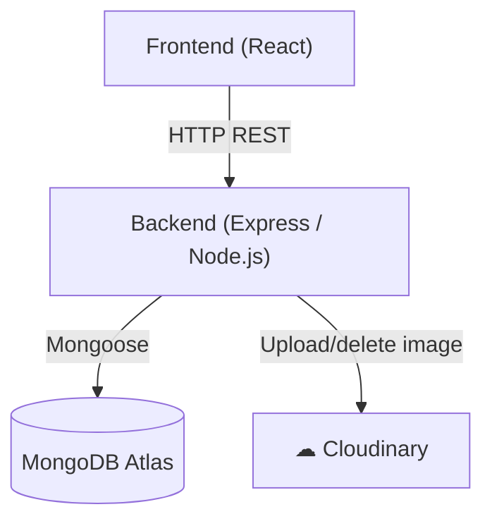
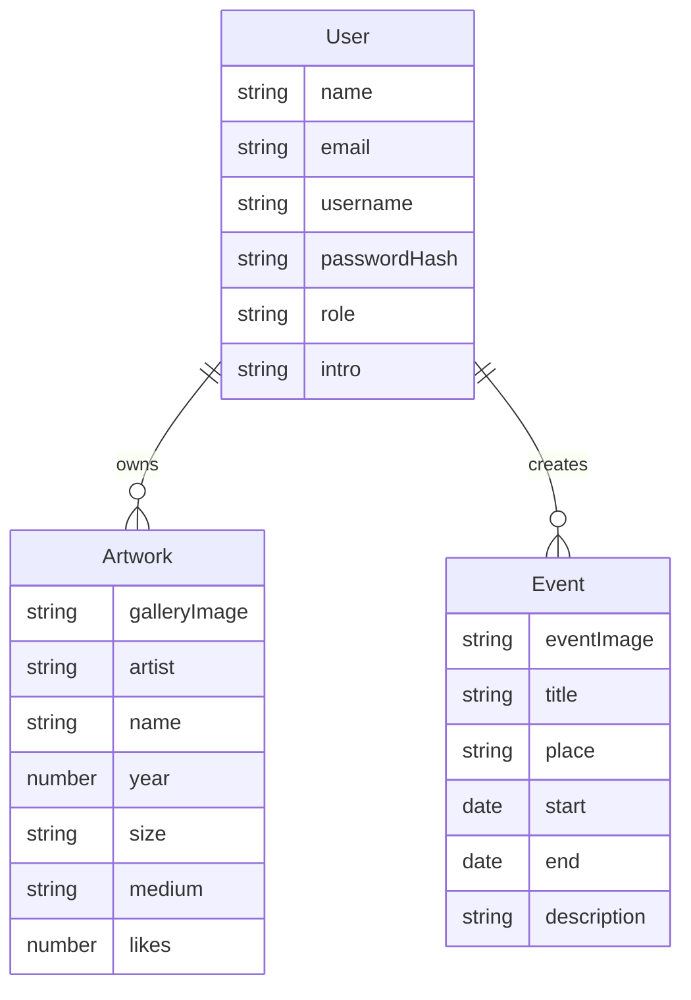
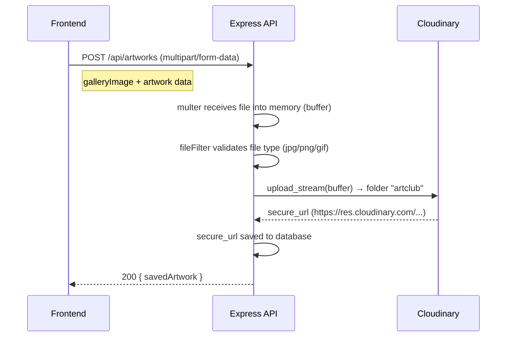
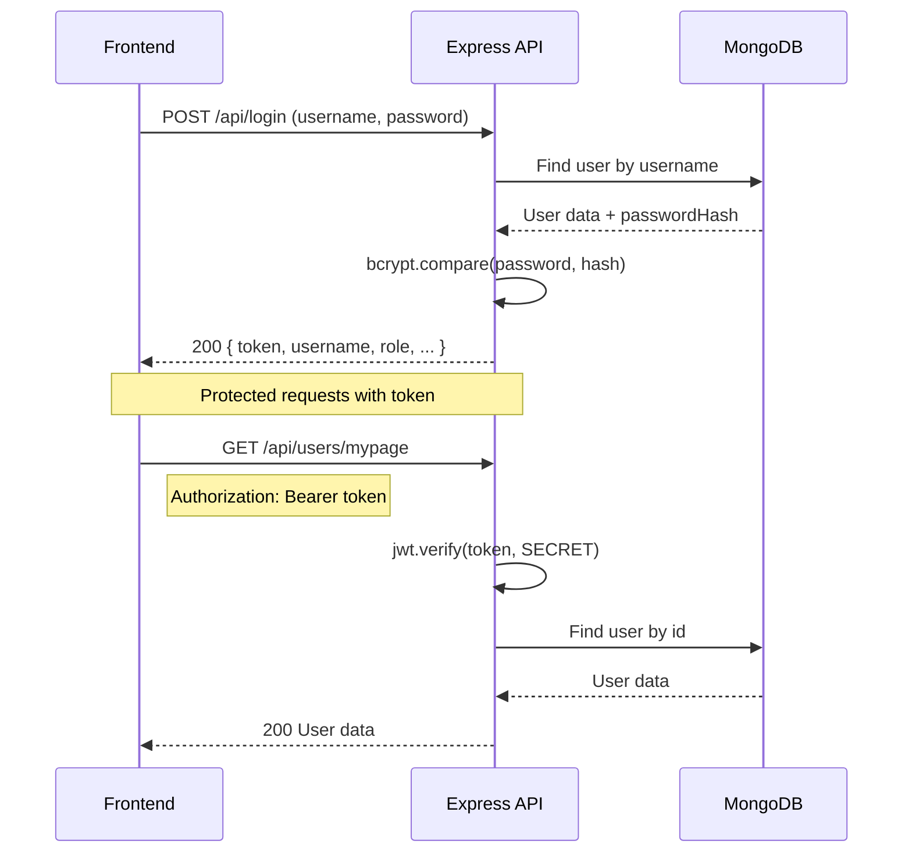
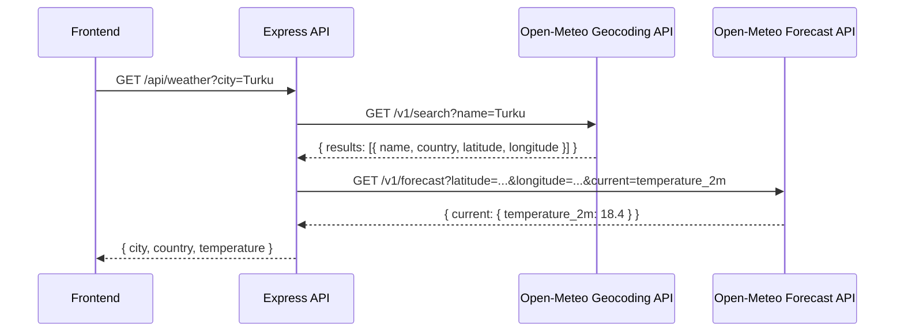

# Art Club — Backend API

[](https://github.com/vsvala/Art_Club_back/actions/workflows/ci.yml)

> This is the **backend** of the Art Club fullstack project.
> Frontend repository: [github.com/vsvala/Art_Club](https://github.com/vsvala/Art_Club)

**Production:** [artclub-q41z.onrender.com](https://artclub-q41z.onrender.com)

REST API Node.js/Express application for the Art Club gallery service. Uses MongoDB as the database and Cloudinary for image storage. Fetches weather data via the Open-Meteo API — geocoding converts a city name to coordinates, which are then used to retrieve the current temperature.

---

## Technologies

- **Node.js** + **Express** — server
- **MongoDB** + **Mongoose** — database
- **Cloudinary** — cloud image storage
- **JWT** — user authentication
- **bcrypt** — password hashing
- **multer** — file uploads
- **Open-Meteo** — weather data (Geocoding + Forecast API, no API key required)

---

## Installation

```bash
git clone https://github.com/vsvala/Art_Club_back.git
cd Art_Club_back
npm install
```

### Environment variables

Create a `.env` file in the project root:

```env
MONGODB_URI=mongodb+srv://<user>:<password>@<cluster>/artclub
TEST_MONGODB_URI=mongodb+srv://<user>:<password>@<cluster>/artclub_test
PORT=3003
SECRET=<jwt-secret-key>
CLOUDINARY_CLOUD_NAME=<cloudinary-name>
CLOUDINARY_API_KEY=<cloudinary-api-key>
CLOUDINARY_API_SECRET=<cloudinary-api-secret>
SEED_ADMIN_PASSWORD=<admin-password>
SEED_MEMBER_PASSWORD=<member-password>
```

---

## Running the app

```bash
# Development mode (nodemon, auto-restart)
npm run dev

# Production
npm start

# Tests
npm test

# Seed the database
npm run seed
```

---

## Architecture

### System overview



### Database model



### Image upload (Multer + Cloudinary)



**How it works:**
- **multer** receives the `multipart/form-data` request and holds the image in memory (not on disk)
- **fileFilter** rejects files that are not images (jpg, png, gif)
- The in-memory buffer is streamed directly to Cloudinary via `upload_stream`
- Cloudinary returns a permanent URL which is stored in the database as `galleryImage`
- The frontend uses this URL directly as `` — the image is served from Cloudinary's CDN

**Image deletion:**
When an artwork is deleted, the backend extracts the `public_id` from the Cloudinary URL and calls `cloudinary.uploader.destroy()` to remove the image from Cloudinary as well.

### Authentication flow



---

## Authentication

The API uses **JWT Bearer tokens**. After login, the token must be sent with every protected request in the Authorization header:

```
Authorization: Bearer <token>
```

### Roles

| Role | Permissions |
|---|---|
| `member` | Authenticated user routes |
| `admin` | All routes |

---

## API documentation

### Login

| Method | Route | Description | Auth |
|---|---|---|---|
| POST | `/api/login` | Log in, returns a JWT token | — |

**Request:**
```json
{ "username": "username", "password": "password" }
```
**Response:**
```json
{
  "token": "eyJ...",
  "username": "username",
  "name": "Name",
  "role": "member",
  "id": "...",
  "email": "...",
  "intro": "..."
}
```

---

### Users `/api/users`

| Method | Route | Description | Auth |
|---|---|---|---|
| POST | `/api/users` | Register (create new user) | — |
| GET | `/api/users/artists` | All users/artists | — |
| GET | `/api/users/artist/:id` | Single artist | — |
| GET | `/api/users/mypage` | Own profile | member |
| GET | `/api/users/admin/:id` | Single user | member (own) |
| GET | `/api/users` | All users | admin |
| PUT | `/api/users/password` | Change password | member |
| PUT | `/api/users/intro/:id` | Update bio | member (own) |
| PUT | `/api/users/info/:id` | Update user info | member (own) |
| PUT | `/api/users/admin` | Change user role | admin |
| DELETE | `/api/users/:id` | Delete user | admin |

**Registration (POST /api/users):**
```json
{
  "name": "Name",
  "email": "email@example.com",
  "username": "username",
  "password": "password123",
  "role": "member"
}
```
- Password must be at least 8 characters
- Username must be unique

---

### Artworks `/api/artworks`

| Method | Route | Description | Auth |
|---|---|---|---|
| GET | `/api/artworks` | All artworks | — |
| GET | `/api/artworks/:id` | Single artwork | — |
| POST | `/api/artworks` | Add artwork + image | member |
| PUT | `/api/artworks/:id` | Update likes | — |
| DELETE | `/api/artworks/:id` | Delete artwork | member |

**Adding an image (POST /api/artworks)** — `multipart/form-data`:

| Field | Type | Description |
|---|---|---|
| `galleryImage` | file | Image (jpg/png/gif, max 5 MB) |
| `artist` | text | Artist name |
| `name` | text | Artwork title |
| `year` | number | Year |
| `size` | text | Size e.g. "50x70 cm" |
| `medium` | text | Medium e.g. "Oil on canvas" |
| `userId` | text | User id |

The image is automatically uploaded to Cloudinary under the folder `artclub`.

---

### Weather `/api/weather`

| Method | Route | Description | Auth |
|---|---|---|---|
| GET | `/api/weather` | Get current temperature for a city | — |

**Query parameters:**

| Parameter | Required | Default | Description |
|---|---|---|---|
| `city` | No | `Helsinki` | City name to look up |

**Example request:**
```
GET /api/weather?city=Turku
```

**Example response:**
```json
{
  "city": "Turku",
  "country": "Finland",
  "temperature": 18.4
}
```

**How it works:**

The endpoint uses two external APIs from [Open-Meteo](https://open-meteo.com/) — both are free and require no API key:



1. **Geocoding** — the city name is resolved to coordinates (latitude/longitude) via the Open-Meteo Geocoding API. The first result is used.
2. **Forecast** — the coordinates are passed to the Open-Meteo Forecast API, which returns the current temperature at 2 m above ground (`temperature_2m`).

**Error responses:**

| Status | Meaning |
|---|---|
| 404 | City not found in geocoding results |
| 502 | Weather data unavailable from Open-Meteo |
| 500 | Unexpected server error |

---

### Events `/api/events`

| Method | Route | Description | Auth |
|---|---|---|---|
| GET | `/api/events` | All events | member |
| POST | `/api/events` | Create event | admin |
| DELETE | `/api/events/:id` | Delete event | admin |

---

## Database models

### User
```
name, email, username (unique), passwordHash, role (member/admin), intro, artworks[]
```

### Artwork
```
galleryImage (Cloudinary URL), artist, name, year, size, medium, likes, user (ref)
```

### Event
```
eventImage, title, place, start, end, description, user (ref)
```

---

## Security & maintenance

### Vulnerability audit

```bash
# Check PRODUCTION vulnerabilities (most important)
npm audit --omit=dev

# Check everything including dev dependencies
npm audit
```

> **Note:** `npm audit` also shows vulnerabilities in dev dependencies (jest, eslint) that do not affect production. Always check separately with `--omit=dev`.

### Automatic fixes

```bash
# Fix safe updates automatically (no breaking changes)
npm audit fix

# Preview what --force would do BEFORE running it
npm audit fix --force --dry-run

# WARNING: --force can cause unexpected downgrades
# Only run if you know what you're doing
npm audit fix --force
```

### Checking for outdated packages

```bash
npm outdated
```

| Column | Meaning |
|---|---|
| Current | Currently installed version |
| Wanted | Maximum allowed version per package.json |
| Latest | Latest available version on npm |

### Updating packages

```bash
# Update all packages within allowed ranges (no major bumps)
npm update

# Update a single package to latest
npm install packagename@latest

# Check what is installed
npm ls packagename
```

### Recommended maintenance routine

| Interval | Action |
|---|---|
| Monthly | `npm audit --omit=dev` — check production vulnerabilities |
| Quarterly | `npm outdated` — consider updates |
| Major updates | Always do in a separate branch, test thoroughly |

### Project-specific notes

**`.npmrc` — `legacy-peer-deps=true`**
Required because `multer-storage-cloudinary@4` declares support only for `cloudinary@v1`, even though `cloudinary@v2` works fine. Without this flag, `npm install` fails with a peer dependency error.

**`package.json` — `overrides.tar`**
Forces the `tar` package to the safe v7 version throughout the dependency tree. Reason: the `bcrypt` → `@mapbox/node-pre-gyp` chain otherwise pulls in a vulnerable version of `tar` for which no fix exists in the 6.x line.

**Jest vulnerabilities**
`npm audit` reports ~17 moderate-severity vulnerabilities inside Jest's internal dependencies (`babel-plugin-istanbul` → `js-yaml`). These are known issues and do not affect production. `npm audit --omit=dev` → 0 vulnerabilities.
