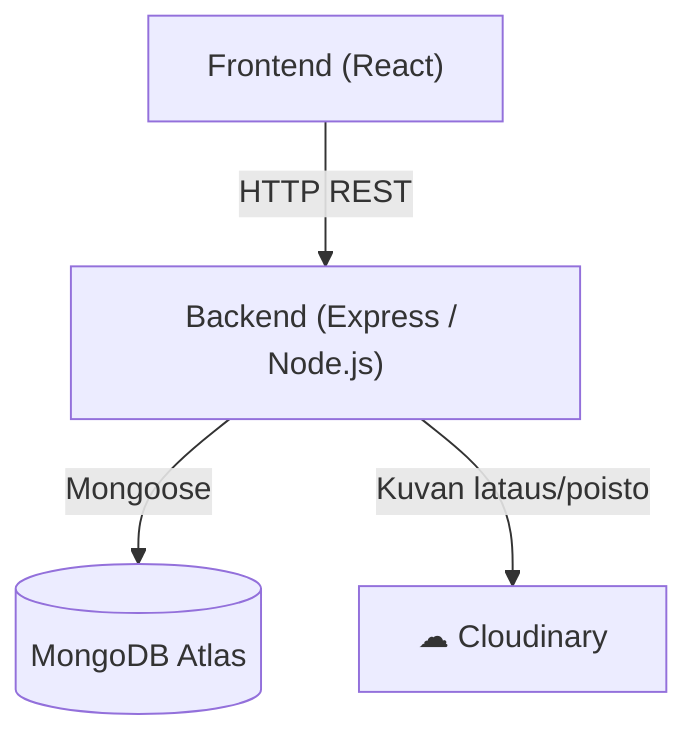
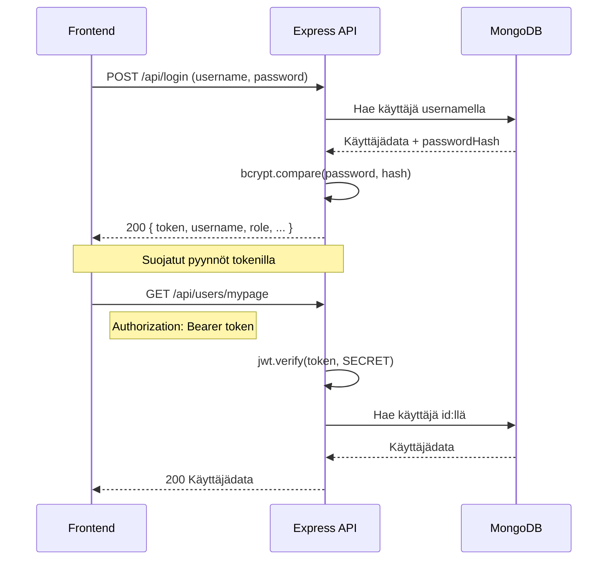

# Art Club — Backend API

REST API Node.js/Express-sovellus Art Club -galleriapalvelulle. Käyttää MongoDB-tietokantaa ja Cloudinary-pilvipalvelua kuvien tallentamiseen.

---

## Teknologiat

- **Node.js** + **Express** — palvelinohjelma
- **MongoDB** + **Mongoose** — tietokanta
- **Cloudinary** — kuvien pilvivarastointi
- **JWT** — käyttäjien tunnistautuminen
- **bcrypt** — salasanojen hashays
- **multer** — tiedostojen lähetys

---

## Asennus

```bash
git clone https://github.com/vsvala/Art_Club_back.git
cd Art_Club_back
npm install
```

### Ympäristömuuttujat

Luo `.env`-tiedosto projektin juureen:

```env
MONGODB_URI=mongodb+srv://<käyttäjä>:<salasana>@<cluster>/artclub
TEST_MONGODB_URI=mongodb+srv://<käyttäjä>:<salasana>@<cluster>/artclub_test
PORT=3003
SECRET=<jwt-salainen-avain>
CLOUDINARY_CLOUD_NAME=<cloudinary-nimi>
CLOUDINARY_API_KEY=<cloudinary-api-avain>
CLOUDINARY_API_SECRET=<cloudinary-api-salaisuus>
SEED_ADMIN_PASSWORD=<admin-salasana>
SEED_MEMBER_PASSWORD=<member-salasana>
```

---

## Käynnistys

```bash
# Kehitysmoodi (nodemon, automaattinen uudelleenkäynnistys)
npm run dev

# Tuotanto
npm start

# Testit
npm test

# Siemendataa tietokantaan
npm run seed
```

---

## Arkkitehtuuri

### Järjestelmärakenne



### Tietokantamalli


### Autentikaatioflow



---

## Autentikointi

API käyttää **JWT Bearer -tokenia**. Kirjautumisen jälkeen token lähetetään jokaisessa pyynnössä Authorization-headerissa:

```
Authorization: Bearer <token>
```

### Roolit

| Rooli | Oikeudet |
|---|---|
| `member` | Kirjautuneen käyttäjän reitit |
| `admin` | Kaikki reitit |

---

## API-dokumentaatio

### Kirjautuminen

| Metodi | Reitti | Kuvaus | Auth |
|---|---|---|---|
| POST | `/api/login` | Kirjautuminen, palauttaa JWT-tokenin | — |

**Pyyntö:**
```json
{ "username": "käyttäjänimi", "password": "salasana" }
```
**Vastaus:**
```json
{
  "token": "eyJ...",
  "username": "käyttäjänimi",
  "name": "Nimi",
  "role": "member",
  "id": "...",
  "email": "...",
  "intro": "..."
}
```

---

### Käyttäjät `/api/users`

| Metodi | Reitti | Kuvaus | Auth |
|---|---|---|---|
| POST | `/api/users` | Rekisteröidy (luo uusi käyttäjä) | — |
| GET | `/api/users/artists` | Kaikki käyttäjät/taiteilijat | — |
| GET | `/api/users/artist/:id` | Yksittäinen taiteilija | — |
| GET | `/api/users/mypage` | Oma profiili | member |
| GET | `/api/users/admin/:id` | Yksittäinen käyttäjä | member (oma) |
| GET | `/api/users` | Kaikki käyttäjät | admin |
| PUT | `/api/users/password` | Vaihda salasana | member |
| PUT | `/api/users/intro/:id` | Päivitä esittely | member (oma) |
| PUT | `/api/users/info/:id` | Päivitä käyttäjätiedot | member (oma) |
| PUT | `/api/users/admin` | Muuta käyttäjän roolia | admin |
| DELETE | `/api/users/:id` | Poista käyttäjä | admin |

**Rekisteröityminen (POST /api/users):**
```json
{
  "name": "Nimi",
  "email": "sahkoposti@example.com",
  "username": "käyttäjänimi",
  "password": "salasana123",
  "role": "member"
}
```
- Salasana vähintään 8 merkkiä
- Käyttäjänimi täytyy olla uniikki

---

### Taideteokset `/api/artworks`

| Metodi | Reitti | Kuvaus | Auth |
|---|---|---|---|
| GET | `/api/artworks` | Kaikki taideteokset | — |
| GET | `/api/artworks/:id` | Yksittäinen taideteos | — |
| POST | `/api/artworks` | Lisää taideteos + kuva | member |
| PUT | `/api/artworks/:id` | Päivitä tykkäykset | — |
| DELETE | `/api/artworks/:id` | Poista taideteos | member |

**Kuvan lisääminen (POST /api/artworks)** — `multipart/form-data`:

| Kenttä | Tyyppi | Kuvaus |
|---|---|---|
| `galleryImage` | tiedosto | Kuva (jpg/png/gif, max 5 MB) |
| `artist` | teksti | Taiteilijan nimi |
| `name` | teksti | Teoksen nimi |
| `year` | numero | Vuosiluku |
| `size` | teksti | Koko esim. "50x70 cm" |
| `medium` | teksti | Tekniikka esim. "Öljy kankaalle" |
| `userId` | teksti | Käyttäjän id |

Kuva tallennetaan automaattisesti Cloudinaryyn kansioon `artclub`.

---

### Tapahtumat `/api/events`

| Metodi | Reitti | Kuvaus | Auth |
|---|---|---|---|
| GET | `/api/events` | Kaikki tapahtumat | member |
| POST | `/api/events` | Luo tapahtuma | admin |
| DELETE | `/api/events/:id` | Poista tapahtuma | admin |

---

## Tietokantamallit

### User
```
name, email, username (uniikki), passwordHash, role (member/admin), intro, artworks[]
```

### Artwork
```
galleryImage (Cloudinary URL), artist, name, year, size, medium, likes, user (ref)
```

### Event
```
eventImage, title, place, start, end, description, user (ref)
```

---

## Tietoturva ja ylläpito

### Haavoittuvuuksien tarkistus

```bash
# Tarkista TUOTANNON haavoittuvuudet (tärkein komento)
npm audit --omit=dev

# Tarkista kaikki mukaan lukien dev-riippuvuudet
npm audit
```

> **Huom:** `npm audit` näyttää myös dev-riippuvuuksien (jest, eslint) haavoittuvuudet jotka eivät vaikuta tuotantoon. Tarkista aina erikseen `--omit=dev`.

### Automaattiset korjaukset

```bash
# Korjaa turvalliset päivitykset automaattisesti (ei breaking changeja)
npm audit fix

# Näytä mitä --force tekisi ENNEN ajamista
npm audit fix --force --dry-run

# VARO: --force voi tehdä odottamattomia downgrade-päivityksiä
# Aja vain jos tiedät mitä teet
npm audit fix --force
```

### Vanhentuneiden pakettien tarkistus

```bash
npm outdated
```

| Sarake | Merkitys |
|---|---|
| Current | Tällä hetkellä asennettu versio |
| Wanted | Suurin sallittu versio package.json:n mukaan |
| Latest | Viimeisin saatavilla oleva versio npm:ssä |

### Pakettien päivitys

```bash
# Päivitä kaikki paketit sallituissa rajoissa (ei major-hyppyjä)
npm update

# Päivitä yksittäinen paketti uusimpaan
npm install paketinnimi@latest

# Tarkista mitä on asennettu
npm ls paketinnimi
```

### Suositeltu ylläpitorutiini

| Väli | Toimenpide |
|---|---|
| Kuukausittain | `npm audit --omit=dev` — tarkista tuotannon haavoittuvuudet |
| Kvartaaleittain | `npm outdated` — harkitse päivityksiä |
| Major-päivitykset | Tee aina erikseen omana haarana, testaa huolellisesti |

### Projektin erityishuomiot

**`.npmrc` — `legacy-peer-deps=true`**
Tarvitaan koska `multer-storage-cloudinary@4` ilmoittaa tukevansa vain `cloudinary@v1`, vaikka `cloudinary@v2` toimii. Ilman tätä `npm install` kaatuu virheeseen.

**`package.json` — `overrides.tar`**
Pakottaa `tar`-paketin turvalliseen v7-versioon koko riippuvuuspuussa. Syy: `bcrypt` → `@mapbox/node-pre-gyp` -ketju käyttää muutoin haavoittuvaa tar-versiota, johon ei ole korjausta 6.x-linjassa.

**Jest-haavoittuvuudet**
`npm audit` näyttää ~17 moderate-tason haavoittuvuutta jest:n sisäisissä riippuvuuksissa (`babel-plugin-istanbul` → `js-yaml`). Nämä ovat tunnettuja eivätkä vaikuta tuotantoon. `npm audit --omit=dev` → 0 haavoittuvuutta.
