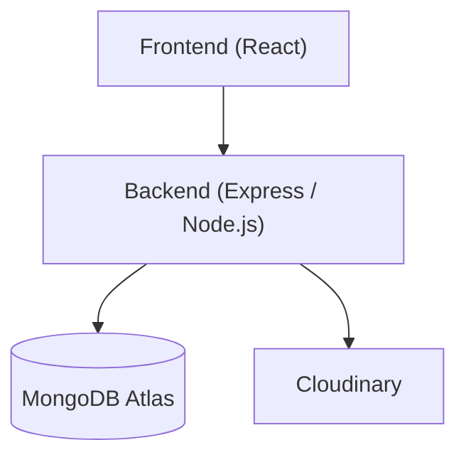

# Art Club — Backend API

[](https://github.com/vsvala/Art_Club_back/actions/workflows/ci.yml)

> This is the **backend** of the Art Club fullstack project.
> Frontend repository: [github.com/vsvala/Art_Club](https://github.com/vsvala/Art_Club)

**Production:** [artclub-q41z.onrender.com](https://artclub-q41z.onrender.com)

Art Club Backend is an authenticated gallery API for managing artworks, user roles, and event content. It combines secure login, image uploads, and role-based access control with a small weather integration endpoint.

The project is a practical portfolio backend for a gallery-style app where artists and admins can create, manage, and publish content. It is most interesting technically because it mixes JWT auth, Cloudinary image handling, and MongoDB-backed access rules in one small service.

REST API Node.js/Express application for the Art Club gallery service. Uses MongoDB as the database and Cloudinary for image storage. Fetches weather data via the Open-Meteo API — geocoding converts a city name to coordinates, which are then used to retrieve the current temperature.

## Highlights

- Full CI/CD pipeline: automated testing, Docker publish, Render deploy, and version tagging
- JWT authentication with role-based access control (member / admin)
- Cloudinary integration for image uploads
- Paginated artwork listing (`GET /api/artworks?page=1&limit=20`) with `total`, `hasMore` metadata
- Health check endpoint with MongoDB connection monitoring
- Third-party API integration: weather proxy via Open-Meteo (geocoding + forecast, no API key required)
- Single Docker image serves both the API and the React frontend
- Centralized error handling — all unexpected errors route through a single `errorHandler` middleware (CastError, ValidationError, TokenExpiredError, LIMIT_FILE_SIZE) with a consistent `{ error: "..." }` JSON fallback and Sentry integration
- Input validation with `express-validator` on all write endpoints (register, password change, profile update, intro, artwork creation, event creation)
- Test suite (Jest), linting (ESLint), and dependency audit on every push
- API reference, architecture diagrams, and security policy in docs/

---

## Technologies

- **Node.js** + **Express** — server
- **MongoDB** + **Mongoose** — database
- **Cloudinary** — cloud image storage
- **JWT** — user authentication
- **bcrypt** — password hashing
- **multer** — file uploads
- **express-validator** — input validation
- **Open-Meteo** — weather data (Geocoding + Forecast API, no API key required)

---

## Installation

```bash
git clone https://github.com/vsvala/Art_Club_back.git
cd Art_Club_back
npm install
```

### Environment variables

Create a `.env` file in the project root:

```env
MONGODB_URI=mongodb+srv://<user>:<password>@<cluster>/artclub
TEST_MONGODB_URI=mongodb+srv://<user>:<password>@<cluster>/artclub_test
PORT=3003
SECRET=<jwt-secret-key>
TEST_SECRET=<jwt-secret-for-tests>
CLOUDINARY_CLOUD_NAME=<cloudinary-name>
CLOUDINARY_API_KEY=<cloudinary-api-key>
CLOUDINARY_API_SECRET=<cloudinary-api-secret>
SEED_ADMIN_PASSWORD=<admin-password>
SEED_MEMBER_PASSWORD=<member-password>
```

### Demo access

Demo credentials are available on request for recruiters and reviewers. Please contact me by email for access details.

---

## Running the app

```bash
# Development mode (nodemon, auto-restart)
npm run dev

# Production
npm start

# Tests
npm test

# Seed the database
npm run seed
```

---

## Testing

- Run local tests with `npm test`; Jest runs in `--runInBand` mode and writes coverage to `./coverage/`.
- Run lint checks with `npm run lint` before pushing changes.
- Test DB and integration/E2E setup details: [docs/test-database-and-e2e.md](docs/test-database-and-e2e.md).

Coverage is generated by Jest, so there is no separate coverage badge in the repository yet.

---

## CI/CD

GitHub Actions runs automatically on pushes and pull requests to `master` with the following pipeline:

| Job                 | Trigger                                           | What it does                                                                                                                                                          |
| ------------------- | ------------------------------------------------- | --------------------------------------------------------------------------------------------------------------------------------------------------------------------- |
| `ci-build-and-test` | every push / PR                                   | installs deps (`npm ci`), runs lint, runs tests against a local MongoDB service container, runs `npm audit --audit-level=high`                                        |
| `docker-publish`    | push to `master` only (after `ci-build-and-test`) | downloads the frontend build artifact from [Art_Club](https://github.com/vsvala/Art_Club), logs in to GHCR, builds and pushes `ghcr.io/vsvala/artclub-backend:latest` |
| `deploy`            | push to `master` only (not `#skip`)               | triggers a Render deploy hook, then polls `/api/health` every 15 s for up to 20 attempts (5 min total) — fails the job if the server does not respond 200             |
| `tag_release`       | after successful `ci-build-and-test` + `deploy`   | auto-bumps the patch version tag via `anothrNick/github-tag-action`                                                                                                   |

### Health check

`GET /api/health` — returns HTTP 200 when the server is running and MongoDB is connected:

```json
{ "status": "ok", "db": "connected", "uptime": 42 }
```

If MongoDB is not connected, returns HTTP 503:

```json
{ "status": "error", "db": "disconnected" }
```

Quick test in terminal:

```bash
curl http://localhost:3003/api/health
```

### Logging

All request and error logging goes through `utils/logger.js` (wraps `console.log`/`console.error`, silent during tests).

Every HTTP request is logged by `requestLogger` middleware with method, path, status code, and response time:

```
GET /api/artworks 200 43ms
```

Password fields (`password`, `oldPassword`, `newPassword`) are masked in logs (`***`) so credentials never appear in plaintext. Errors flow through a centralized `errorHandler` middleware, which logs with `logger.error` and returns a consistent `{ error: "..." }` JSON response. Route handlers call `next(error)` — they do not log or respond directly. Unsupported file upload types are logged as errors.

### Pipeline flow

```
push to master
      │
      ▼
ci-build-and-test  ──────────────────────────────────────────────┐
      │                                                           │
      ├──► docker-publish  →  ghcr.io/vsvala/artclub-backend:latest
      │
      └──► deploy  →  Render  →  health check /api/health
                │
                ▼
           tag_release  →  auto-bump patch version tag
```

`docker-publish` runs once `ci-build-and-test` passes. `deploy` waits for both `ci-build-and-test` **and** `docker-publish` to succeed.
`tag_release` waits for both `ci-build-and-test` **and** `deploy` to succeed.

### Rollback

If a deploy fails the health check, the pipeline stops and `tag_release` is skipped. To roll back manually:

1. Go to [dashboard.render.com](https://dashboard.render.com)
2. Open the service → **Deploys** tab
3. Find the last successful deploy and click **"Rollback to this deploy"**

---

## Docker

The backend is packaged as a Docker image (`node:22-alpine`) and published automatically to `ghcr.io/vsvala/artclub-backend:latest` on every successful push to `master`. The CI pipeline bundles the latest frontend build into the image, so a single container serves both the API and the React app.

For build commands, run instructions, and image details, see [docs/docker.md](docs/docker.md).

---

## Architecture


```mermaid
graph TD
    Frontend["Frontend (React)"] --> API["Backend (Express / Node.js)"]
    API --> MongoDB[("MongoDB Atlas")]
    API --> Cloudinary["Cloudinary"]
```

Requests flow from the frontend into the Express API. Controllers handle only HTTP concerns (parsing, response); business logic lives in a dedicated service layer (`services/`). Services coordinate database access and Cloudinary side-effects, and never receive `req`/`res` objects. Weather data is proxied through the same backend so the frontend talks to one consistent API surface.

For the fuller set of flow diagrams and model notes, see [docs/architecture.md](docs/architecture.md).

---

## Authentication

The API uses **JWT Bearer tokens**. After login, the token must be sent with every protected request in the Authorization header:

```
Authorization: Bearer <token>
```

### Roles

| Role     | Permissions               |
| -------- | ------------------------- |
| `member` | Authenticated user routes |
| `admin`  | All routes                |

---

## API documentation

The detailed endpoint reference, request/response examples, multipart payloads, weather flow, and data model notes are available in [docs/api.md](docs/api.md).

At a glance, this API covers authentication, user management, artwork CRUD and image uploads, weather proxying, and admin-managed events.

Authentication uses JWT Bearer tokens, and access is further controlled with role-based checks for `member` and `admin` flows.

---

## Security

See [SECURITY.md](.github/SECURITY.md) for the reporting policy.

Maintenance notes, audit commands, and dependency caveats live in [docs/security-notes.md](docs/security-notes.md).

Detailed architecture diagrams and flow notes are available in [docs/architecture.md](docs/architecture.md).

### HTTP security headers (Helmet)

The API uses [Helmet](https://helmetjs.github.io/) to set HTTP security headers on every response. Helmet is applied as the first middleware so headers are present on all routes including errors.

Key headers set by Helmet:

| Header                      | Protection                                                                          |
| --------------------------- | ----------------------------------------------------------------------------------- |
| `Content-Security-Policy`   | Restricts which scripts, styles, and resources the browser may load — mitigates XSS |
| `X-Frame-Options`           | Prevents the page from being embedded in an iframe — mitigates clickjacking         |
| `Strict-Transport-Security` | Instructs the browser to use HTTPS only                                             |
| `X-Content-Type-Options`    | Prevents the browser from guessing the content type                                 |
| `Referrer-Policy`           | Controls how much referrer information is sent to other sites                       |

To verify the headers locally:

```bash
curl -I http://localhost:3003/api/health
```

To audit the production deployment use [securityheaders.com](https://securityheaders.com).

---

## Sentry error tracking

This backend uses [Sentry](https://sentry.io) for production error visibility.

### Setup

1. Create a Node.js project in Sentry and copy the DSN.
2. Add the DSN to your environment variables:

```env
SENTRY_DSN=https://<key>@<org>.ingest.de.sentry.io/<project-id>
```

3. Install the SDK:

```bash
npm install @sentry/node --save
```

4. Initialize Sentry early in the app startup flow via [instrument.js](instrument.js) and import it first in [index.js](index.js).
5. Register the Express error handler in [app.js](app.js) after all routes and before the custom error middleware.

### Verify

For a temporary test, add a route like this in [app.js](app.js):

```js
app.get("/debug-sentry", (req, res) => {
  throw new Error("My first Sentry error!");
});
```

Then open `http://localhost:3003/debug-sentry` and confirm the event appears in the Sentry dashboard.

### Notes

- Keep the test route only while verifying the integration.
- `NODE_ENV=production` is recommended for deployed environments.
- The backend does not need frontend source maps; those are only relevant for browser bundles.

---

## Future improvements

### High priority

- **Token refresh** — implement refresh token pattern so users stay logged in securely beyond the current 10 h JWT expiry

### Production readiness

- Add audit logging for admin actions and security-relevant events (role changes, user deletions)
- Migrate JWT from `localStorage` to `httpOnly` cookies (see section below)

### JWT storage

JWT tokens are currently stored in `localStorage`, which is accessible to JavaScript and therefore vulnerable to XSS attacks. A more secure alternative is to use `httpOnly` cookies, which cannot be read by JavaScript at all.

Migrating to cookie-based auth requires changes on both sides: the backend would set and read the token via a cookie instead of the `Authorization` header, and the frontend would stop managing the token manually. This is a larger refactor and has been left as a future improvement.
