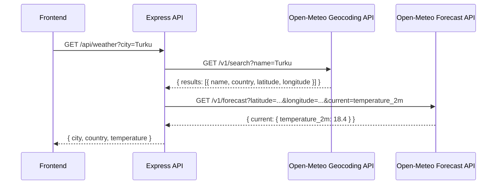

# API Documentation

This document contains the detailed endpoint reference for the Art Club Backend.

## Authentication

The API uses **JWT Bearer tokens**. After login, the token must be sent with every protected request in the Authorization header:

```text
Authorization: Bearer <token>
```

### Roles

| Role     | Permissions               |
| -------- | ------------------------- |
| `member` | Authenticated user routes |
| `admin`  | All routes                |

---

## Login

| Method | Route        | Description                 | Auth |
| ------ | ------------ | --------------------------- | ---- |
| POST   | `/api/login` | Log in, returns a JWT token | —    |

**Request:**

```json
{ "username": "username", "password": "password" }
```

**Response:**

```json
{
  "token": "eyJ...",
  "username": "username",
  "name": "Name",
  "role": "member",
  "id": "...",
  "email": "...",
  "intro": "..."
}
```

---

## Users `/api/users`

| Method | Route                   | Description                | Auth         |
| ------ | ----------------------- | -------------------------- | ------------ |
| POST   | `/api/users`            | Register (create new user) | —            |
| GET    | `/api/users/artists`    | All users/artists          | —            |
| GET    | `/api/users/artist/:id` | Single artist              | —            |
| GET    | `/api/users/mypage`     | Own profile                | member       |
| GET    | `/api/users/admin/:id`  | Single user                | member (own) |
| GET    | `/api/users`            | All users                  | admin        |
| PUT    | `/api/users/password`   | Change password            | member       |
| PUT    | `/api/users/intro/:id`  | Update bio                 | member (own) |
| PUT    | `/api/users/info/:id`   | Update user info           | member (own) |
| PUT    | `/api/users/admin`      | Change user role           | admin        |
| DELETE | `/api/users/:id`        | Delete user                | admin        |

**Registration (POST /api/users):**

```json
{
  "name": "Name",
  "email": "email@example.com",
  "username": "username",
  "password": "password123",
  "role": "member"
}
```

- Password must be at least 8 characters
- Username must be unique

---

## Artworks `/api/artworks`

| Method | Route               | Description         | Auth   |
| ------ | ------------------- | ------------------- | ------ |
| GET    | `/api/artworks`     | All artworks        | —      |
| GET    | `/api/artworks/:id` | Single artwork      | —      |
| POST   | `/api/artworks`     | Add artwork + image | member |
| PUT    | `/api/artworks/:id` | Update likes        | —      |
| DELETE | `/api/artworks/:id` | Delete artwork      | member |

**Adding an image (POST /api/artworks)** — `multipart/form-data`:

| Field          | Type   | Description                   |
| -------------- | ------ | ----------------------------- |
| `galleryImage` | file   | Image (jpg/png/gif, max 5 MB) |
| `artist`       | text   | Artist name                   |
| `name`         | text   | Artwork title                 |
| `year`         | number | Year                          |
| `size`         | text   | Size e.g. "50x70 cm"          |
| `medium`       | text   | Medium e.g. "Oil on canvas"   |
| `userId`       | text   | User id                       |

The image is automatically uploaded to Cloudinary under the folder `artclub`.

---

## Weather `/api/weather`

| Method | Route          | Description                        | Auth |
| ------ | -------------- | ---------------------------------- | ---- |
| GET    | `/api/weather` | Get current temperature for a city | —    |

**Query parameters:**

| Parameter | Required | Default    | Description          |
| --------- | -------- | ---------- | -------------------- |
| `city`    | No       | `Helsinki` | City name to look up |

**Example request:**

```text
GET /api/weather?city=Turku
```

**Example response:**

```json
{
  "city": "Turku",
  "country": "Finland",
  "temperature": 18.4
}
```

**How it works:**

The endpoint uses two external APIs from [Open-Meteo](https://open-meteo.com/) — both are free and require no API key:



1. **Geocoding** — the city name is resolved to coordinates (latitude/longitude) via the Open-Meteo Geocoding API. The first result is used.
2. **Forecast** — the coordinates are passed to the Open-Meteo Forecast API, which returns the current temperature at 2 m above ground (`temperature_2m`).

**Error responses:**

| Status | Meaning                                  |
| ------ | ---------------------------------------- |
| 404    | City not found in geocoding results      |
| 502    | Weather data unavailable from Open-Meteo |
| 500    | Unexpected server error                  |

---

## Events `/api/events`

| Method | Route             | Description  | Auth   |
| ------ | ----------------- | ------------ | ------ |
| GET    | `/api/events`     | All events   | member |
| POST   | `/api/events`     | Create event | admin  |
| DELETE | `/api/events/:id` | Delete event | admin  |

---

## Database models

### User

```text
name, email, username (unique), passwordHash, role (member/admin), intro, artworks[]
```

### Artwork

```text
galleryImage (Cloudinary URL), artist, name, year, size, medium, likes, user (ref)
```

### Event

```text
eventImage, title, place, start, end, description, user (ref)
```
