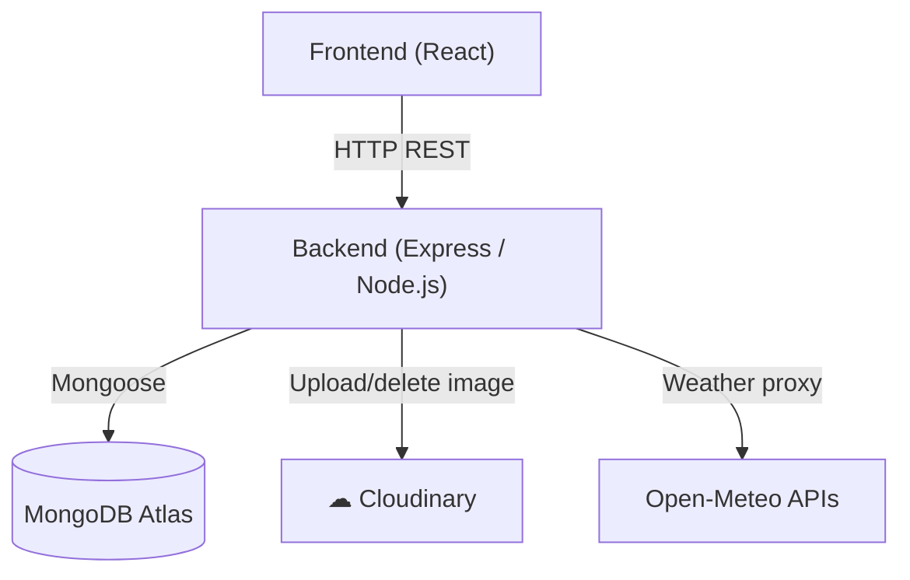
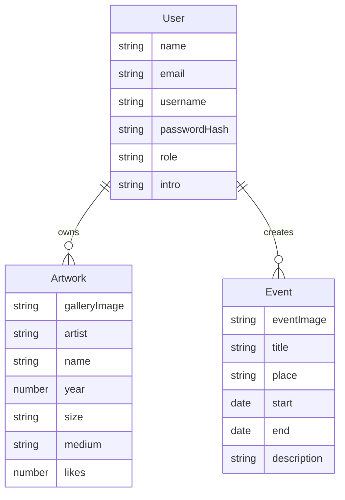
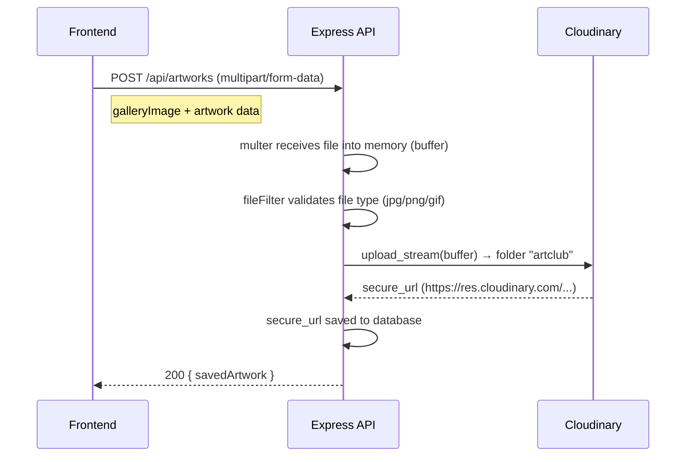
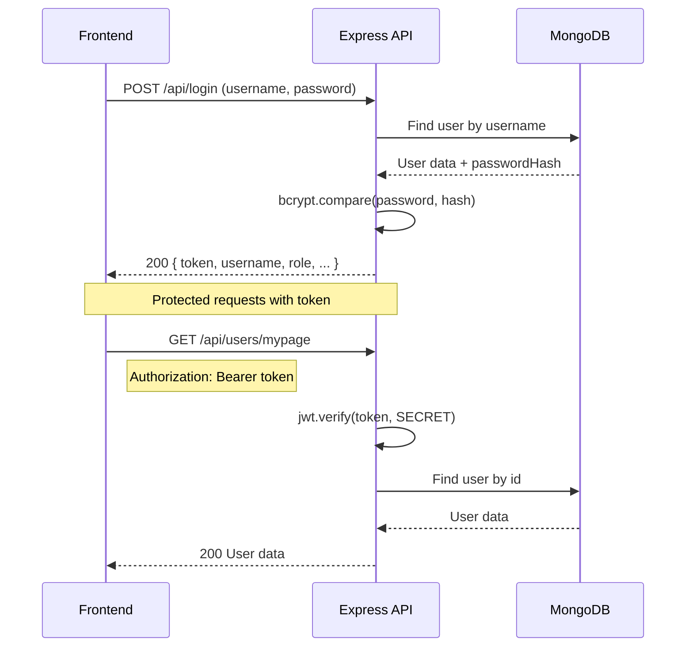
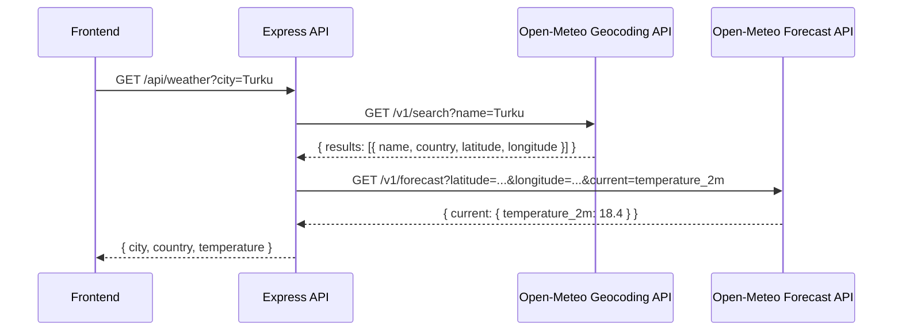

# Architecture

This document collects the fuller architecture diagrams and data-flow notes that are too detailed for the main README.

## System Overview

The backend acts as the single application layer for the frontend. It verifies JWT tokens, applies role-based checks, persists structured data in MongoDB, streams artwork images to Cloudinary, and proxies weather requests so the frontend does not need to talk to multiple external services directly.

## Database Model

## Key Data Flows

### Artwork Upload

Artwork images are accepted in memory, validated, uploaded to Cloudinary, and then stored as a permanent URL in MongoDB. Deleting an artwork removes the corresponding Cloudinary asset as part of the cleanup flow.

### Authentication

JWT keeps the backend stateless for authenticated requests, while the middleware layer decides whether the token can access a user route or an admin route.

### Weather Proxy

The weather endpoint is a thin proxy layer: it resolves the city name to coordinates, fetches the forecast, and returns only the data the frontend needs.
