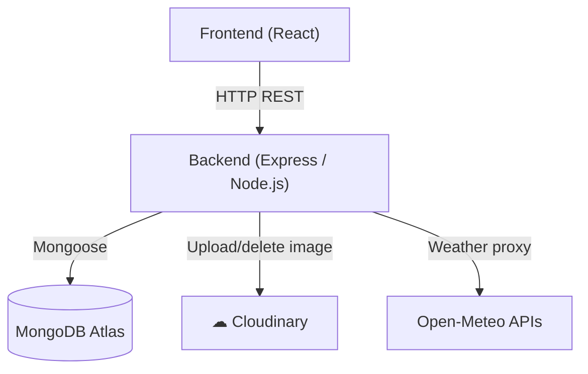
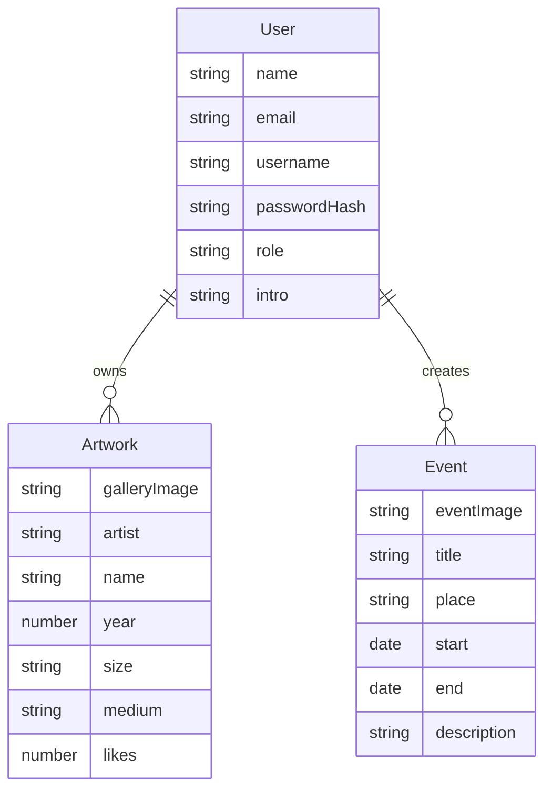
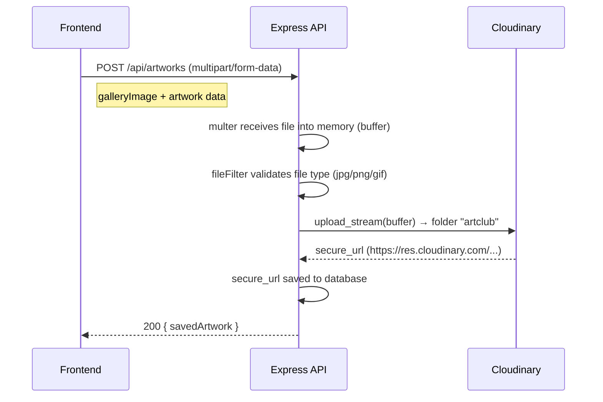
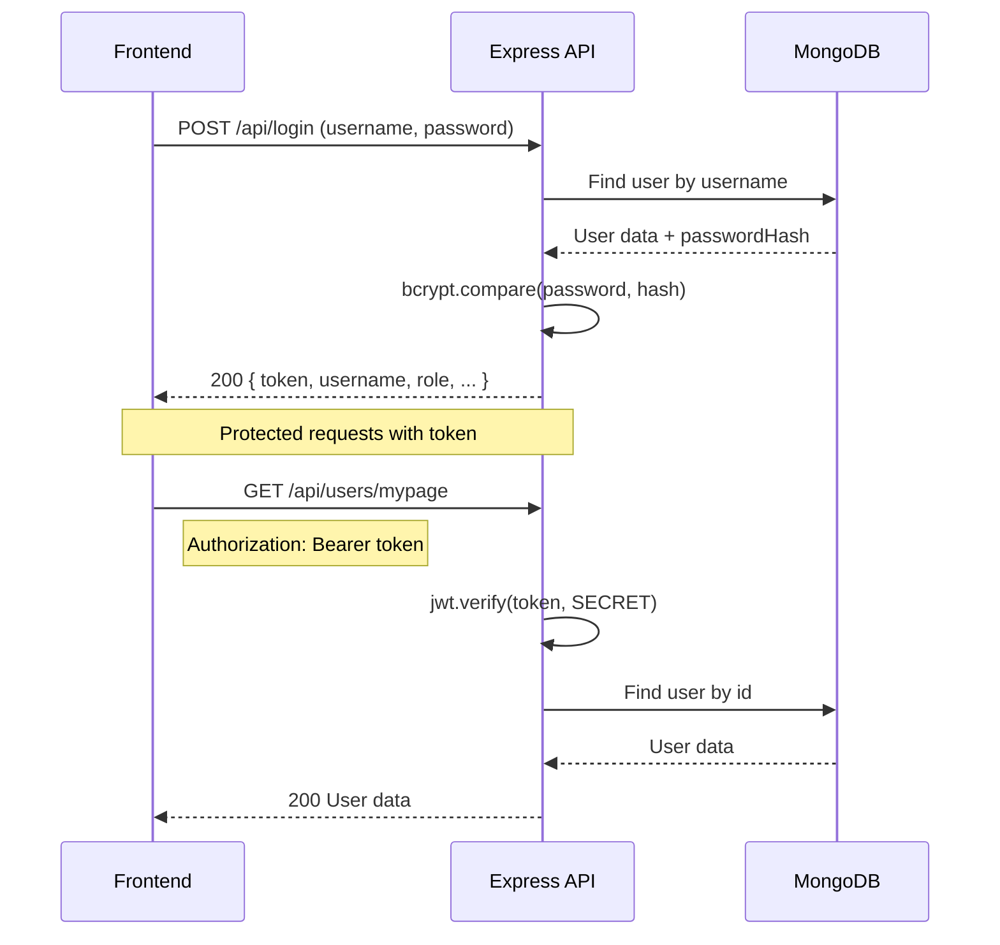
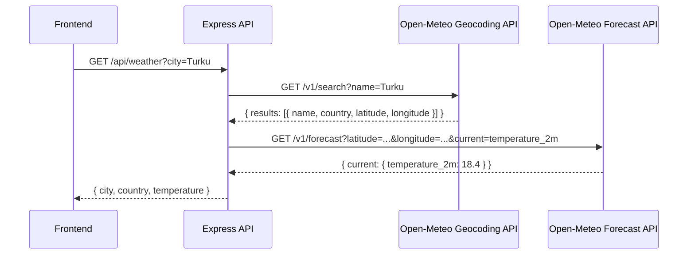

# Architecture

This document collects the fuller architecture diagrams and data-flow notes that are too detailed for the main README.

## System Overview


```mermaid
graph TD
    Frontend["Frontend (React)"]
    API["Backend (Express / Node.js)"]
    MongoDB[("MongoDB Atlas")]
    Cloudinary["☁ Cloudinary"]
    OpenMeteo["Open-Meteo APIs"]

    Frontend -->|"HTTP REST"| API
    API -->|"Mongoose"| MongoDB
    API -->|"Upload/delete image"| Cloudinary
    API -->|"Weather proxy"| OpenMeteo
```

The backend acts as the single application layer for the frontend. It verifies JWT tokens, applies role-based checks, persists structured data in MongoDB, streams artwork images to Cloudinary, and proxies weather requests so the frontend does not need to talk to multiple external services directly.

## Layered Architecture

The solution is a three-layer architecture where each layer has a single responsibility.

```
┌──────────────────────────────────────────────────────────────┐
│                        HTTP Request                          │
└─────────────────────────────┬────────────────────────────────┘
                              ↓
┌──────────────────────────────────────────────────────────────┐
│                  CONTROLLER  (controllers/)                  │
│                                                              │
│   ✓ Parses req  (body, params, query, headers)              │
│   ✓ Calls the service with the right arguments              │
│   ✓ Sends res  (status + json)                              │
│   ✓ Calls next(error) on throw                              │
│                                                              │
│   ✗ No business logic                                        │
│   ✗ No bcrypt, JWT, or direct DB queries                    │
└─────────────────────────────┬────────────────────────────────┘
                              ↓
┌──────────────────────────────────────────────────────────────┐
│                   SERVICE  (services/)                       │
│                                                              │
│   ✓ All business logic                                       │
│   ✓ Database queries  (Model.find, Model.save ...)          │
│   ✓ Side-effects  (Cloudinary, email, SMS ...)              │
│   ✓ Business rules  (unique username, password policy ...)  │
│   ✓ Returns data OR throws an Error                         │
│                                                              │
│   ✗ Never receives req / res objects                        │
│   ✗ Never sets HTTP status codes                            │
└──────────────┬──────────────────────────┬────────────────────┘
               ↓                          ↓
┌──────────────────────┐    ┌─────────────────────────────────┐
│   MODEL  (models/)   │    │   EXTERNAL SERVICES             │
│                      │    │                                 │
│  Mongoose schema     │    │  Cloudinary  (images)           │
│  MongoDB queries     │    │  Open-Meteo  (weather)          │
│  Validation rules    │    │  Third-party APIs               │
└──────────────────────┘    └─────────────────────────────────┘
```

**Error flow:**

```
HTTP POST /api/users
    ↓
Controller — parses req.body, calls userService.registerUser(body)
    ↓
userService.registerUser() — findOne: username already exists
    ↓  throws Error('username must be unique')  { status: 400 }
Controller — catch (error) → next(error)
    ↓
errorHandler middleware
    ↓
res.status(400).json({ error: 'username must be unique' })
```

---

## Database Model


```mermaid
erDiagram
    User {
        string name
        string email
        string username
        string passwordHash
        string role
        string intro
    }
    Artwork {
        string galleryImage
        string artist
        string name
        number year
        string size
        string medium
        number likes
    }
    Event {
        string eventImage
        string title
        string place
        date start
        date end
        string description
    }

    User ||--o{ Artwork : "owns"
    User ||--o{ Event : "creates"
```

## Key Data Flows

### Artwork Upload


```mermaid
sequenceDiagram
    participant Client as Frontend
    participant API as Express API
    participant Cloudinary

    Client->>API: POST /api/artworks (multipart/form-data)
    Note right of Client: galleryImage + artwork data
    API->>API: multer receives file into memory (buffer)
    API->>API: fileFilter validates file type (jpg/png/gif)
    API->>Cloudinary: upload_stream(buffer) → folder "artclub"
    Cloudinary-->>API: secure_url (https://res.cloudinary.com/...)
    API->>API: secure_url saved to database
    API-->>Client: 200 { savedArtwork }
```

Artwork images are accepted in memory, validated, uploaded to Cloudinary, and then stored as a permanent URL in MongoDB. Deleting an artwork removes the corresponding Cloudinary asset as part of the cleanup flow.

### Authentication


```mermaid
sequenceDiagram
    participant Client as Frontend
    participant API as Express API
    participant DB as MongoDB

    Client->>API: POST /api/login (username, password)
    API->>DB: Find user by username
    DB-->>API: User data + passwordHash
    API->>API: bcrypt.compare(password, hash)
    API-->>Client: 200 { token, username, role, ... }

    Note over Client,API: Protected requests with token

    Client->>API: GET /api/users/mypage
    Note right of Client: Authorization: Bearer token
    API->>API: jwt.verify(token, SECRET)
    API->>DB: Find user by id
    DB-->>API: User data
    API-->>Client: 200 User data
```

JWT keeps the backend stateless for authenticated requests, while the middleware layer decides whether the token can access a user route or an admin route.

### Weather Proxy


```mermaid
sequenceDiagram
    participant Client as Frontend
    participant API as Express API
    participant Geo as Open-Meteo Geocoding API
    participant Weather as Open-Meteo Forecast API

    Client->>API: GET /api/weather?city=Turku
    API->>Geo: GET /v1/search?name=Turku
    Geo-->>API: { results: [{ name, country, latitude, longitude }] }
    API->>Weather: GET /v1/forecast?latitude=...&longitude=...&current=temperature_2m
    Weather-->>API: { current: { temperature_2m: 18.4 } }
    API-->>Client: { city, country, temperature }
```

The weather endpoint is a thin proxy layer: it resolves the city name to coordinates, fetches the forecast, and returns only the data the frontend needs.
